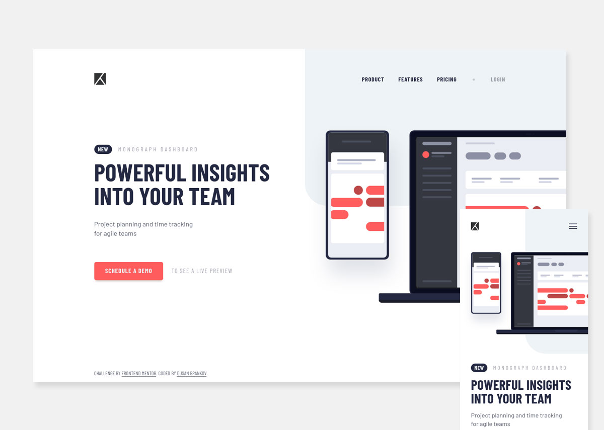

# Frontend Mentor - Tracking intro web page

This is a solution to the [Project tracking intro component challenge on Frontend Mentor](https://www.frontendmentor.io/challenges/project-tracking-intro-component-5d289097500fcb331a67d80e).

## Users should be able to:

- [x] View the optimal layout for the site depending on their device's screen size
- [x] See hover and focus states for all interactive elements on the page
- [x] Create the background shape using code
- [x] Navigate through the content using assistive technologies

## Preview site

:computer: <https://dusan-b.github.io/fm-tracking-intro-component/>

## Built with

- Semantic HTML5 markup
- Sass
- Flexbox
- `clamp()` CSS function
- BEM
- Mobile-first workflow
- JavaScript

## Work process

Because of the layout's simplicity, it was a quite comfortable working process without any major obstacles.

The only thing which gave me a bit of a headache was the positioning of the image on the very right of the page. 'Cause I really don't like using `position: absolute;` in combination with `background-image`, as it always feels like a hacky solution to me and the ability to responsively adjust to the viewport is lost. I used it anyway, but in such a way that the image behaves like a responsive inline image (``) that grows and shrinks according to the size of the viewport, with the help of custom properties and the CSS function `clamp()`, no media queries at all.

So, I mainly was playing with the [`clamp()`](https://developer.mozilla.org/en-US/docs/Web/CSS/clamp) function. It allowed me to create not only smoothly responsive fonts, but also a perfectly responsive logo (and background image I mentioned above). It impressed me how awesome this function works and what possibilities it brings with it. I will definitely reuse this technique and deal with it in more detail.

## Useful resources

- [Practical Uses of CSS Math Functions: calc, clamp, min, max](https://moderncss.dev/practical-uses-of-css-math-functions-calc-clamp-min-max/#clamp)

---

Frontend Mentor — [@dusan-b](https://www.frontendmentor.io/profile/dusan-b)